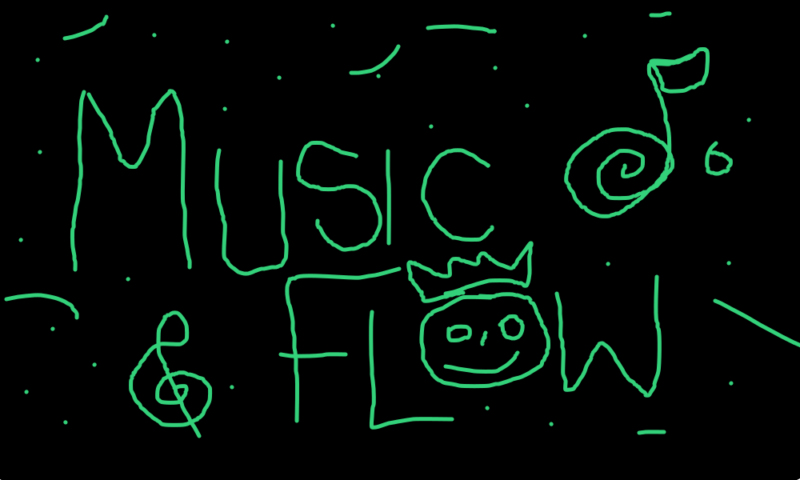
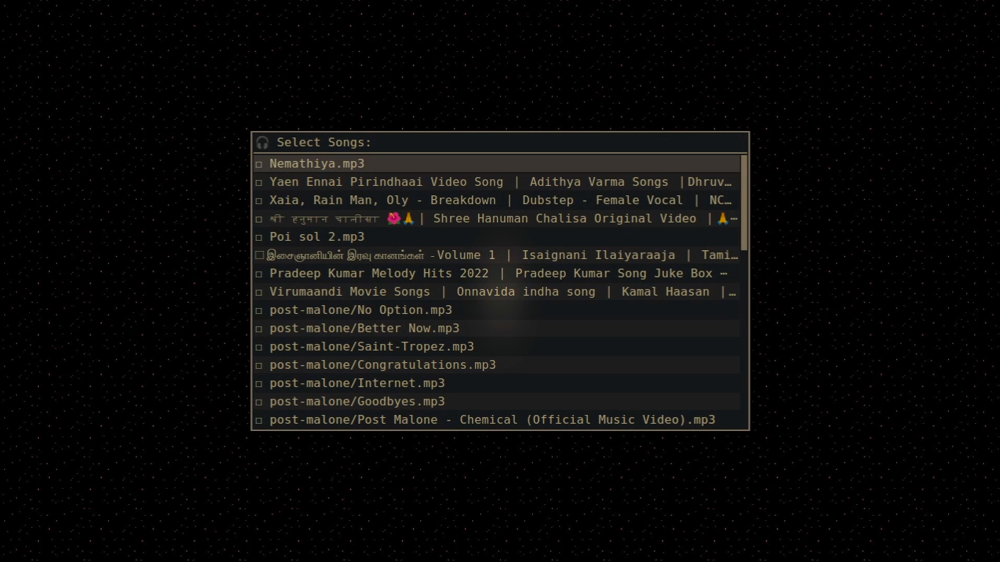
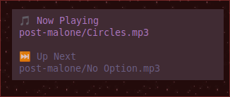

<p align="center">
  
</p>


# MusicFlow 🎶

**MusicFlow** is a terminal-driven, Rofi-based interactive music player for Linux. It leverages **MPV** for playback, allows **playlist management**, **queue editing**, **shuffle playback**, and shows **desktop notifications** for the current and upcoming tracks. It's lightweight, fast, and fully controllable from menus.

---

## Features

- 🎵 **Play selected tracks** from your Music directory.
- 📂 **Playlist management**:
  - Load playlists (`.m3u`)
  - Save current playlist
  - Append tracks to an existing playlist
  - Shuffle a playlist and play immediately (temporary shuffle file)
- 📜 **Queue management**:
  - View current queue
  - Enqueue new tracks
  - Edit queue: Move up/down (`J/K`) and delete tracks (`DD`)
- 🎛️ **Playback controls**:
  - Pause/Resume
  - Next / Previous track
  - Seek forward/backward 10 seconds
  - Toggle loop
  - Quit playback
- 🔔 **Notifications**:
  - Current track info
  - Next track info
- ✅ Keeps menus open until explicitly exited.

---

## Requirements

- Linux
- **MPV** (with IPC support)
- **Rofi** (for menus)
- **jq** (for JSON parsing)
- **socat** (for IPC communication)
- **notify-send** (for desktop notifications)
- Bash ≥ 4.0

---

## Installation

1. Clone or copy `MusicFlow.sh` to your local bin:

```bash
mkdir -p ~/.local/bin
cp MusicFlow.sh ~/.local/bin/musicflow
chmod +x ~/.local/bin/musicflow
```

2. Make sure your Music folder exists:

```bash
mkdir -p ~/Music
mkdir -p ~/Music/playlists
```

3. Ensure MPV, Rofi, jq, socat, and notify-send are installed:

```bash
# Debian/Ubuntu
sudo apt install mpv rofi jq socat libnotify-bin
```

## Usage

- Run the script:

```bash
musicflow
# or run the below 
~/.local/bin/musicflow

```

- You will see the main menu:
```

🎵 Play
📜 Queue
📂 Playlist
🎛️ Controls
❌ Exit
```

1. Play

- Choose tracks from your Music directory.
- Starts playback via MPV.
- Displays notifications for current and next track.

2. Queue

- View Queue: See upcoming tracks.
- Enqueue: Add tracks to the current queue.
- Edit Queue: Move tracks up/down (J/K), delete (DD), ESC to exit.

3. Playlist

- Load Playlist: Load an existing .m3u playlist.
- Save Playlist: Save the current queue as a playlist.
- Append Playlist: Add new tracks to an existing playlist.
- Shuffle Playlist: Shuffle a playlist and play immediately (temp file deleted after playback).

4. Controls

- Pause/Resume
- Next / Previous
- Seek ±10s
- Toggle Loop
- Quit playback
- Back to main menu
---
## Keybindings (Queue Editor)


| Key | Action          |
| --- | --------------- |
| J   | Move track down |
| K   | Move track up   |
| DD  | Delete track    |
| ESC | Exit editor     |

---

Notes

- Temporary shuffled playlists are automatically deleted after playback.
- Notifications are triggered on track change.
- Works best with Rofi configured with a dark theme.
- Yes, ChatGPT typed all the code. I just supplied the brilliance.

---
## screenshot






---

## Contributing

Contributions are welcome!
- Bug reports and feature requests via GitHub Issues.
- Pull requests for improvements are encouraged.

## License

This project is licensed under the MIT License — see the [LICENSE](LICENSE) file for details.

*Idea by me, code partly “magically” generated by ChatGPT 😉*
